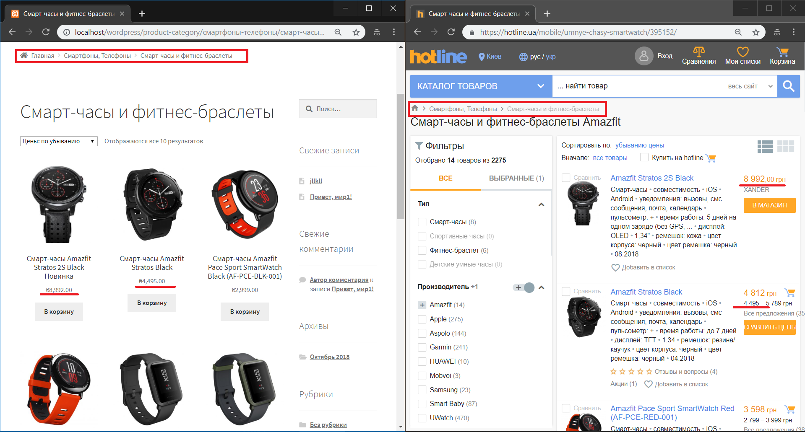

# hotlineParser

PHP parser that parses products from the hotline.ua and adds it to the WordPress store.
Features:
* Parse a specific category/subcategory/number of products through offsets and limits
* Parsing high quality images using hotline.ua internal API
* Working with WordPress store through WooCommerce API and their PHP library
* Working with brands using Perfect WooCommerce Brands API

Screenshots:




How to run:

1. Deploy WordPress
2. Install "WooCommerce" and "Perfect WooCommerce Brands" plugins
3. Generate `customer key` and `customer secret` at WooCommerce API settings and add it to [the dao](dao/WoocomerceDAO.php)
4. Run the [script]() by specifying the numbers of categories/subcategories/products and offsets.
A few examples. We can specify that we want to parse 1 category, its 2 subcategories with 8 products per category:
```php script 1 2 8```.
We can add the product parsing offset(5) in addition to the previous example:
```php script 1 2 8 0 0 5```.
Or we can just use the defaults values(5 categories x 4 subcategories x 10 products) without any offsets:
```php script```.
5. Done! Check your WooCommerce store.
